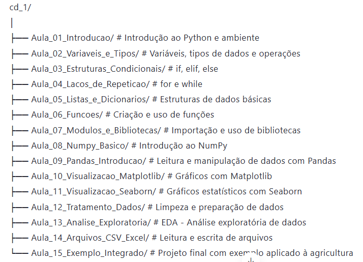

# 🌾 Tutorial resumido: Ciência de Dados com Python – Nível Básico  
### Para estudantes de Pós-Graduação em Engenharia Agrícola

## 📚 Sobre o Tutorial

Este repositório destina-se a  **estudantes de pós-graduação em Engenharia Agrícola** que desejam aplicar técnicas de análise de dados em suas pesquisas.

O objetivo é fornecer uma introdução prática ao uso do **Python** para:
- Tratamento de dados agronômicos
- Análise exploratória
- Visualização de resultados
- Automação de tarefas repetitivas

Cada aula contém:
- Uma apresentação resumida dos conceitos
- Exemplos executáveis e comentados
- Espaço para adaptação às necessidades individuais do aluno

---

## 🗂️ Estrutura do Repositório

